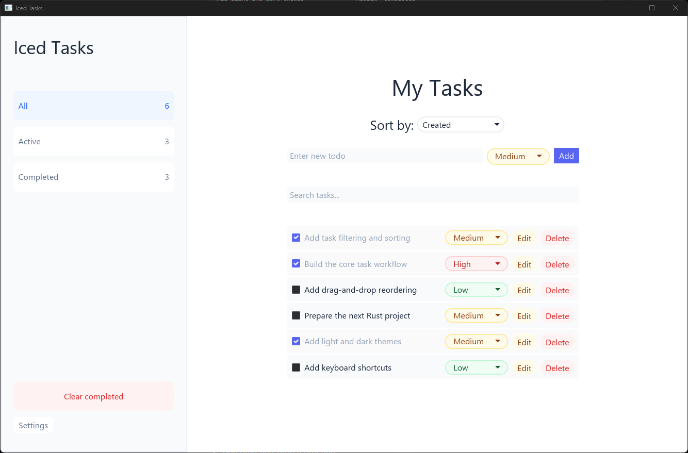
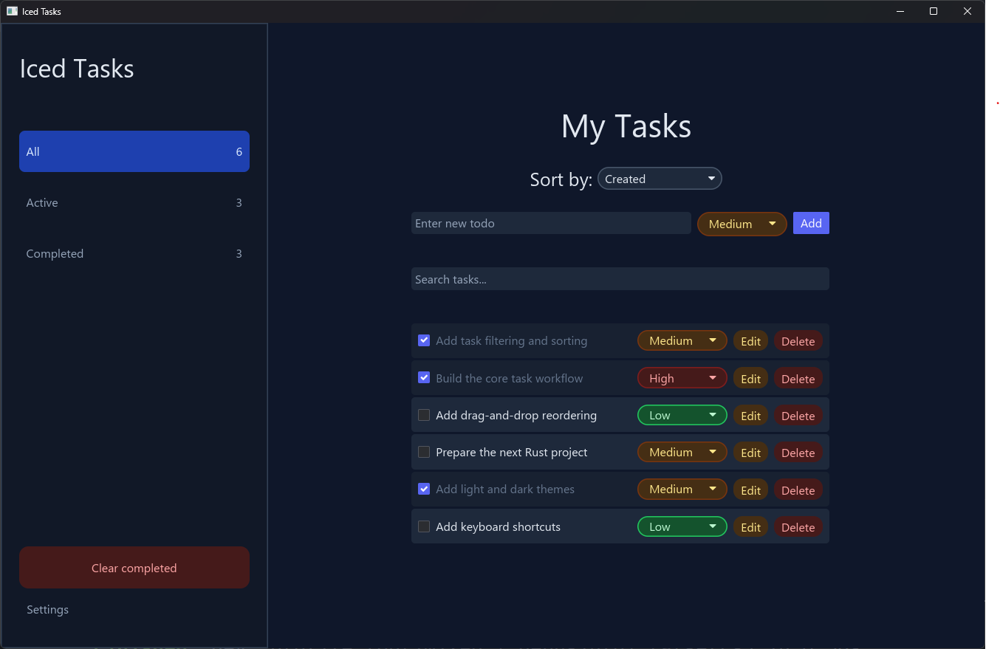

# Iced Task Manager

A desktop task management application built with Rust and the [`iced`](https://github.com/iced-rs/iced) GUI framework.

The project focuses on Rust application architecture, state management, local persistence, theming, and responsive desktop UI development.

## Preview

### Light theme



### Dark theme



## Features

* Create, edit, and delete tasks
* Mark tasks as active or completed
* Assign priorities to tasks
* Filter tasks by status:
  * All
  * Active
  * Completed
* Search tasks by name
* Sort tasks
* Clear completed tasks
* Switch between light and dark themes
* Adapt the interface to window resizing
* Save tasks and theme preferences locally using JSON

## Technologies

* [Rust](https://www.rust-lang.org/)
* [iced](https://github.com/iced-rs/iced)
* [Serde](https://serde.rs/) for serialization
* [serde_json](https://github.com/serde-rs/json) for JSON persistence
* Cargo

## Getting Started

### Requirements

Make sure Rust and Cargo are installed on your computer.

Rust can be installed using [rustup](https://rustup.rs/).

### Installation

Clone the repository:

```bash
git clone https://github.com/yveshajjar/iced-task-manager.git
cd iced-task-manager
```

Run the application:

```bash
cargo run
```

Run an optimized release build:

```bash
cargo run --release
```

## Project Structure

```text
iced-task-manager/
├── assets/
│   ├── task-manager-preview-light.png
│   └── task-manager-preview-dark.png
├── src/
│   ├── main.rs
│   └── ...
├── Cargo.toml
├── Cargo.lock
└── README.md
```

The codebase separates the application state, messages, update logic, interface components, task management logic, and theme configuration to make the project easier to maintain and extend.

## Data Persistence

Tasks and theme preferences are stored locally in JSON files:

* `todos.json`
* `theme.json`

These files are created and updated automatically by the application and are excluded from version control.

## What I Learned

This project helped me practice:

* Designing an application using an Elm-inspired message-based architecture
* Managing complex application state in Rust
* Building reusable user interface components
* Implementing light and dark themes
* Saving and loading structured data with JSON
* Handling user input and window events
* Organizing a growing Rust codebase

## Roadmap

* [ ] Add task deadlines  
* [ ] Add categories or tags  
* [ ] Add drag-and-drop task reordering  
* [ ] Add keyboard shortcuts  

## Status

The core task management features are complete. Additional features and refinements may be added as the project evolves.
